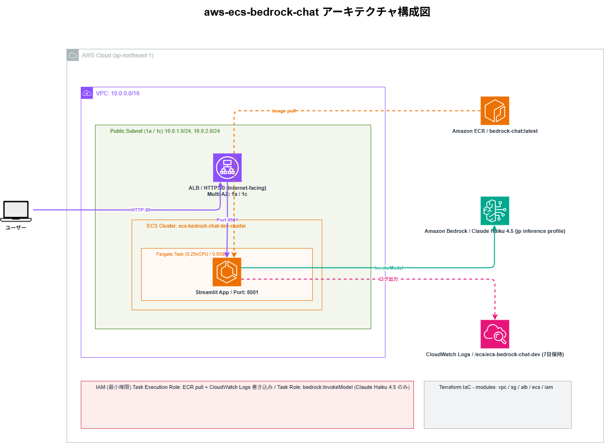
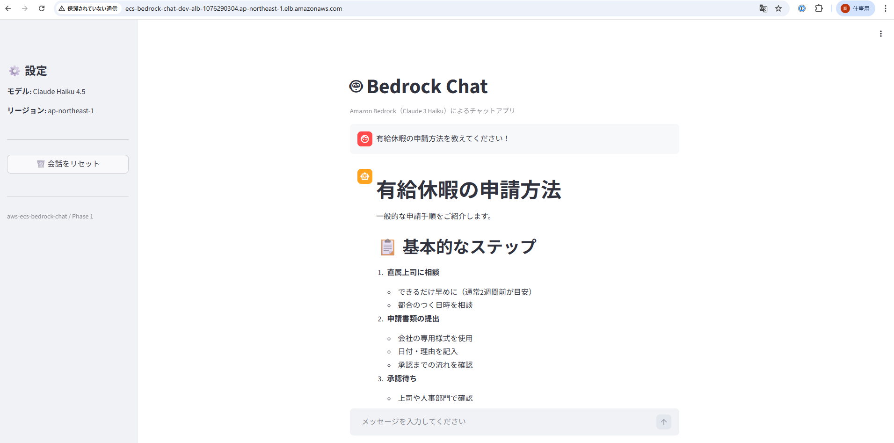
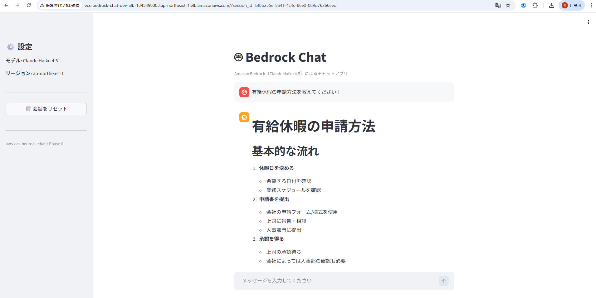
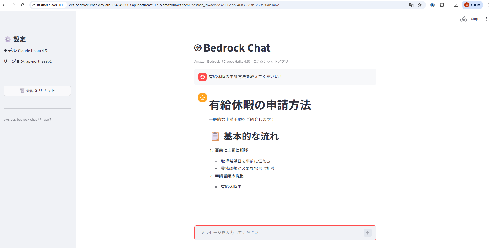
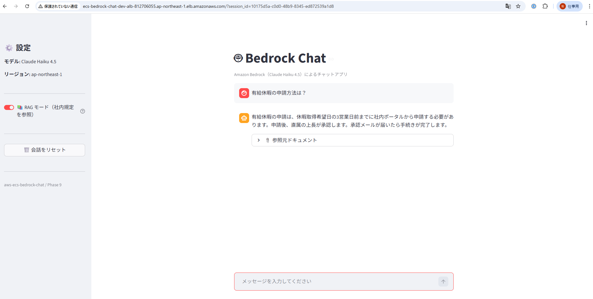

# aws-ecs-bedrock-chat


Amazon ECS/Fargate + Amazon Bedrock（Claude Haiku 4.5）によるチャットアプリの PoC。
Streamlit Web UI を Docker コンテナ化し、ALB 経由でインターネット公開する構成を Terraform で IaC 管理。

---

## アーキテクチャ



| コンポーネント | 内容 |
|---|---|
| **ALB** | Internet-facing / HTTP:80 / Multi-AZ（1a・1c） |
| **ECS Fargate** | 0.25 vCPU / 0.5 GB / Streamlit Port 8501 |
| **Amazon Bedrock** | Claude Haiku 4.5（jp 推論プロファイル経由） |
| **Amazon DynamoDB** | 会話履歴の永続化（PAY_PER_REQUEST / TTL: 7日） |
| **Amazon ECR** | コンテナイメージ管理（bedrock-chat:latest） |
| **CloudWatch Logs** | ECS タスクログ（7日保持） |
| **IAM** | Task Execution Role / Task Role（最小権限） |
| **VPC** | パブリックサブネット 2AZ / NAT Gateway なし（学習用コスト最適化） |
| **Bedrock Knowledge Base** | S3 + OpenSearch Serverless + Titan Embed v2 による RAG（Phase 9） |


---

## デモ

ALB の DNS 名でブラウザからアクセスし、Claude Haiku 4.5 とチャットできます。
URL に自動で `?session_id=xxxx` が付与され、**ブラウザをリロードしても会話履歴が DynamoDB から復元**されます。



**Phase 6: DynamoDB 会話履歴連携** — URL に `?session_id=xxxx` が付与され、リロード後も履歴が復元されます。



**Phase 7: ストリーミングレスポンス** — 文字がリアルタイムで流れます（右上の Stop ボタンで中断可）。



**Phase 9: RAG モード（Bedrock Knowledge Base 連携）** — サイドバーのトグルで通常チャットと RAG を切り替え。社内ドキュメントを参照した回答と引用元を表示。



| 機能 | 説明 |
|---|---|
| チャット | Claude Haiku 4.5 に自然言語で質問できる |
| ストリーミング表示 | 回答が1文字ずつリアルタイムで流れる（`invoke_model_with_response_stream`） |
| 履歴永続化 | リロード後も DynamoDB から会話履歴を自動復元 |
| 会話リセット | サイドバーのボタンで DynamoDB の履歴ごとクリア |
| RAG モード | Bedrock Knowledge Base でドキュメント検索→回答生成（引用元表示付き） |

---

## 技術スタック

| カテゴリ | 技術 |
|---|---|
| アプリ | Python 3.11 / Streamlit / boto3 |
| コンテナ | Docker / Amazon ECR |
| オーケストレーション | Amazon ECS / AWS Fargate |
| ロードバランサー | Application Load Balancer（Multi-AZ） |
| AI | Amazon Bedrock / Claude Haiku 4.5（クロスリージョン推論プロファイル） |
| RAG | Bedrock Knowledge Base / OpenSearch Serverless / Titan Embed Text v2 |
| DB | Amazon DynamoDB（会話履歴の永続化） |
| IaC | Terraform（モジュール構成） |
| 監視 | Amazon CloudWatch Logs |

---

## ディレクトリ構成

```
aws-ecs-bedrock-chat/
├── app/
│   ├── app.py               # Streamlit チャットアプリ
│   └── requirements.txt
├── Dockerfile
├── .dockerignore
├── environments/
│   └── dev/
│       ├── main.tf          # モジュール統合
│       ├── variables.tf
│       ├── outputs.tf
│       └── terraform.tfvars.example
├── modules/
│   ├── vpc/                 # VPC / サブネット / IGW / ルートテーブル
│   ├── sg/                  # ALB SG / ECS Task SG
│   ├── alb/                 # ALB / Target Group / Listener
│   ├── ecs/                 # Cluster / Task Definition / Service
│   ├── iam/                 # Task Execution Role / Task Role
│   ├── dynamodb/            # 会話履歴テーブル（PAY_PER_REQUEST / TTL）
│   └── knowledgebase/       # Bedrock Knowledge Base / OpenSearch Serverless / S3
└── docs/
    ├── architecture.drawio
    ├── architecture.drawio.png
    └── screenshots/
```

---

## デプロイ手順

### 前提条件

- AWS CLI 設定済み（`ap-northeast-1`）
- Terraform >= 1.5
- Docker
- Amazon Bedrock で Claude Haiku 4.5 の利用申請済み

### 1. ECR リポジトリ作成 & Docker イメージ push

```bash
# ECR リポジトリ作成
aws ecr create-repository --repository-name bedrock-chat --region ap-northeast-1

# Docker ビルド & push
aws ecr get-login-password --region ap-northeast-1 | \
  docker login --username AWS --password-stdin <ACCOUNT_ID>.dkr.ecr.ap-northeast-1.amazonaws.com

docker build -t bedrock-chat ./app
docker tag bedrock-chat:latest <ACCOUNT_ID>.dkr.ecr.ap-northeast-1.amazonaws.com/bedrock-chat:latest
docker push <ACCOUNT_ID>.dkr.ecr.ap-northeast-1.amazonaws.com/bedrock-chat:latest
```

### 2. Terraform 変数ファイル作成

```bash
cp environments/dev/terraform.tfvars.example environments/dev/terraform.tfvars
# terraform.tfvars を編集して ecr_image_uri を実際の URI に変更
```

### 3. Terraform apply

```bash
cd environments/dev
terraform init
terraform plan
terraform apply
```

### 4. アクセス確認

```bash
# ALB の DNS 名を確認
terraform output alb_dns_name

# ブラウザで http://<ALB_DNS_NAME> にアクセス
```

### 5. リソース削除

```bash
terraform destroy
```

---

## IAM 設計（最小権限）

| ロール | 権限 |
|---|---|
| **Task Execution Role** | ECR pull / CloudWatch Logs 書き込み |
| **Task Role** | `bedrock:InvokeModel`（Claude Haiku 4.5 推論プロファイル + 基盤モデル ARN のみ） |
| **Task Role** | `dynamodb:GetItem` / `dynamodb:PutItem`（会話履歴テーブルのみ） |
| **Task Role** | `bedrock:Retrieve` / `bedrock:RetrieveAndGenerate`（Knowledge Base のみ） |

---

## 技術的なポイント・工夫

- **ECS Fargate × ALB** のコンテナ公開パターンを Terraform モジュールで実装
- **クロスリージョン推論プロファイル**（`jp.*`）経由で Claude Haiku 4.5 を呼び出す方法を習得
  - on-demand throughput 非対応モデルは推論プロファイル ARN + 基盤モデル ARN の両方を IAM で許可する必要がある
- **NAT Gateway なし**のパブリックサブネット構成で学習コストを最小化（`assign_public_ip = true`）
- ECS Service に `lifecycle { ignore_changes = [task_definition] }` を設定し、CI/CD デプロイ時の差分を抑制
- **ストリーミング API**（`invoke_model_with_response_stream`）で回答をリアルタイム表示。`InvokeModel` と `InvokeModelWithResponseStream` は**別々の IAM アクション**のため両方許可が必要
- **ECS はステートレス**なため、会話履歴は DynamoDB に外出し。リロード・再起動後も履歴が保持される
- **URL クエリパラメータ**（`?session_id=xxxx`）で session_id を永続化し、Streamlit のセッション管理と組み合わせた
- DynamoDB の **TTL 設定**で 7 日後に古いセッションを自動削除し、運用コストを抑制
- `terraform destroy` で全リソースをクリーンアップ可能
- **RAG（Retrieval-Augmented Generation）**：S3 にドキュメントを置くだけで Knowledge Base が自動インデックス化。`RetrieveAndGenerate` API でドキュメント検索＋回答生成を1回の API コールで実現
- RAG 用モデルと通常チャット用モデルを使い分け：`RetrieveAndGenerate` は推論プロファイル非対応のため Claude 3 Haiku（基盤モデル直接指定）を使用

---

## コスト目安（検証時）

| リソース | 概算 |
|---|---|
| ECS Fargate（0.25vCPU / 0.5GB × 1タスク） | ~$0.01/時 |
| ALB | ~$0.02/時 |
| CloudWatch Logs | 無料枠内（7日保持・少量） |
| Bedrock（Claude Haiku 4.5） | ~$0.001/1K tokens |
| DynamoDB（PAY_PER_REQUEST / 少量書き込み） | ほぼ無料枠内 |
| OpenSearch Serverless（最低 2 OCU） | ~$0.48/時（検証後は destroy 推奨） |
| Bedrock Knowledge Base Sync | ~$0.001/1K tokens（インデックス作成時のみ） |

> 検証後は `terraform destroy` でリソース削除を推奨。

---

## CI/CD パイプライン（Phase 8）

`master` ブランチへの push で自動デプロイが実行されます。

```
git push → GitHub Actions
  → Docker build
  → ECR push（コミット SHA タグ + latest）
  → ECS force-new-deployment
  → services-stable まで待機
```

### OIDC 認証の仕組み

AWS アクセスキーを GitHub に保存せず、**OIDC（OpenID Connect）** で一時トークンを発行します。

```
GitHub Actions 起動
  → GitHub が OIDC トークンを発行
  → AWS STS が検証・IAM Role を一時 AssumeRole
  → 一時クレデンシャルで ECR/ECS を操作
  → 処理完了後にトークンが自動失効
```

### GitHub Repository Variables の設定

| 変数名 | 値 | 説明 |
|---|---|---|
| `AWS_ROLE_ARN` | `arn:aws:iam::<account_id>:role/...-github-actions-role` | `terraform output github_actions_role_arn` で確認 |

---

## セキュリティ設計

### OIDC Trust Policy（最小権限）

```hcl
# リポジトリ × ブランチの完全一致で絞り込み（StringEquals）
# StringLike（ワイルドカード可）は使用しない
Condition = {
  StringEquals = {
    "token.actions.githubusercontent.com:aud" = "sts.amazonaws.com"
    "token.actions.githubusercontent.com:sub" = "repo:<owner>/<repo>:ref:refs/heads/master"
  }
}
```

| 設定 | 理由 |
|---|---|
| `StringEquals` で完全一致 | `StringLike` はワイルドカードが効くため使用しない |
| `ref:refs/heads/master` 限定 | PR・feature ブランチからの AssumeRole を防止 |
| `aud: sts.amazonaws.com` | GitHub OIDC トークンの正規用途を限定 |

### IAM 最小権限（GitHub Actions Role）

| 権限 | 対象リソース | 理由 |
|---|---|---|
| `ecr:GetAuthorizationToken` | `*`（API仕様上不可避） | ECR ログインに必要 |
| `ecr:PutImage` 他 push 系 | 特定リポジトリ ARN のみ | 他リポジトリへの push を防止 |
| `ecs:UpdateService` | 特定サービス ARN のみ | 他サービスへの操作を防止 |
| `ecs:DescribeServices` | 特定サービス ARN のみ | `wait services-stable` に必要 |
| `iam:PassRole` | **付与しない** | `force-new-deployment` は不要 |

### GitHub Actions 権限設定

```yaml
permissions:
  id-token: write  # OIDC トークン取得（必要最小限）
  contents: read   # コード読み取りのみ
```

- **secrets にアクセスキーを保存しない**（OIDC のみで認証）
- `push: branches: master` のみトリガー（fork/PR 起点では実行されない）

### 検証環境における妥協点と対策

| 項目 | 検証環境の現状 | 本番で追加すべき対策 |
|---|---|---|
| Action pinning | `@v4` タグ固定 | `@sha256:...` で SHA 固定 |
| state 管理 | ローカル state | S3 + DynamoDB バックエンド |
| 手動承認 | なし | GitHub Environment + Required reviewers |
| Branch Protection | なし | force push 禁止 + PR required |
| 監査ログ | GitHub Actions ログのみ | AWS CloudTrail 有効化 |

### `terraform destroy` 時の注意

`aws_iam_openid_connect_provider`（GitHub OIDC Provider）は**アカウントグローバルリソース**です。同一アカウントで他プロジェクトが GitHub OIDC を使用している場合、`destroy` で削除されると影響を受けます。

```bash
# destroy 前に他リソースへの影響を確認
terraform plan -destroy
```

---

## AI 活用について

本プロジェクトは以下の Anthropic ツールを活用して開発しています。

| ツール | 用途 |
|---|---|
| **Claude Code** | インフラ設計・Terraform コード生成・デバッグ・コードレビュー。コミットまで一貫してサポート |
| **Claude Cowork** | 技術調査・設計相談・ドキュメント作成を日常的に活用。AI との協働を業務フローに組み込んでいる |
| **カスタム Skills** | Terraform / Python / AWS に特化した Skills を設定・継続的に更新。自分の技術スタックに最適化したワークフローを構築 |

> AI を「使う」だけでなく、自分の業務・技術スタックに合わせて**設定・運用・改善し続ける**ことを意識しています。

---

## 関連リポジトリ

- [aws-bedrock-agent](https://github.com/satoshif1977/aws-bedrock-agent) - Bedrock Agent + Lambda FAQ ボット
- [aws-rag-knowledgebase](https://github.com/satoshif1977/aws-rag-knowledgebase) - S3 + API Gateway + Lambda + Bedrock RAG PoC
- [terraform-3tier-webapp](https://github.com/satoshif1977/terraform-3tier-webapp) - 3層 Web アーキテクチャ Terraform 実装
